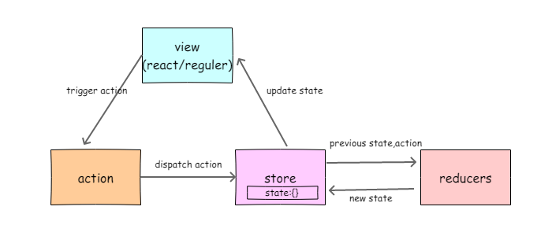

# Redux理解和应用

> 写在前面：说到redux就不得不说react，之前做过一个项目是纯用react的，所有的数据都使用props和state来管理。无赖后来没有等到项目引进redux就终止了。那时候觉得没有使用redux，react也能自己很好的管理自己的数据，组件之间的通信仅仅是通过props或者回调函数来完成（组件之间的通信参看https://www.javascriptstuff.com/component-communication/）。后来另一个项目中使用了redux，感觉如果当初的业务在复杂一些，比如组件中很多3层组件的情况，并且这些组件之间有复杂的通信，那么单单使用react可能就比较吃力了。


## Redux是这么

redux是一种解决方案。react只是 DOM 的一个抽象层，并不是 Web 应用的完整解决方案。redux并不是必须要用的。但是当组件之间涉及到下面的场景，就需要引入redux。

- 某个组件的状态，需要共享
- 某个状态需要在任何地方都可以拿到
- 一个组件需要改变全局状态
- 一个组件需要改变另一个组件的状态

发生上面情况时，如果不使用 Redux 或者其他状态管理工具，不按照一定规律处理状态的读写，代码很快就会变成一团乱麻。你需要一种机制，可以在同一个地方查询状态、改变状态、传播状态的变化。


## Redux工作流程



## 设计理念

在接触mvvm的框架的时候会有一些感觉，我们是通过改变数据来改变视图的，因为mvvm框架通常是双向绑定的。react是单向数据流，我们也可以通过某种手段使得同样的数据对应同样的视图。redux的设计理念就是，所有的数据都由store来管理。所有的变动都由action来发起。当view层发起一个action以后，最后由reducers来执行，reducers是一个纯函数，也就是说，只要是同样的输入，必定得到同样的输出。经过reducers处理返回新的state更新到store中。这样的流程使得所有的数据更新都要通过这个流程。

可以理解为一个所有的组件都共用一个store，这样，第一小节中提到的：组件的状态，需要共享；某个状态需要在任何地方都可以拿到；一个组件需要改变全局状态；一个组件需要改变另一个组件的状态等组件之间的通行或者跨页面之间的共享问题就得到解决。

有了redux的规范，项目的文件也会更加清晰，同时也提升了开发体验

## 基本概念

### Store

Store 就是保存数据的一个对象，一个容器。整个应用有一个 Store。

Redux 提供`createStore`这个函数，用来生成 Store。

```js
import { createStore } from 'redux';
const store = createStore(fn);
```

### state

`Store`对象包含所有数据。如果想得到某个时刻的数据，就要对 Store 生成快照。这种快照，就叫做 State。

当前时刻的 State，可以通过`store.getState()`拿到。State也是一个对象

### action

action是唯一可以改变state的方法。state的改变会导致view层的改变。redux的设计就是希望所有对state的修改都只能通过action来触发。所以action是view层想要改变的唯一方法。action是一个对象，其中type是必须的，表示触发哪个action。

```
{
  type: 'PAY_UPDATE_LOADED',
  data: data,
  id: id,
  params: params
}
```


```js
p.update = function (data, id, params) {
  return {
    type: 'PAY_UPDATE_LOADED',
    data: data,
    id: id,
    params: params
  }
}
```

### store.dispatch()

view想要更新数据state的唯一方法。

```js
store.dispatch({
  type: types.LIST,
  data: res
})
```

dispatch接受的参数是action。当view层调用dispatch以后，store会根据type: types.LIST的值来判断调用那个一个具体的Reducer。这一步store怎么知道有哪些Reducers是可以搜索的呢，其实是因为，所有的Reducers都经过createStore()处理。具体的细节我还会再写一篇关于原理的笔记。

```
 var store = createStore(Reducers);
```

## Reducer

reducer就是最后真正改变的的state的函数，这个函数会根据不同的case，更新state，然后返回新的state。随着state的跟新，view就也发生了更新。

```js
define([
  '../../constants/types.js'
], function (types) {
  var initState = {};
  return function (state, action) {
    state = state || initState;
    switch (action.type) {
      case types.LIST:
        return Object.assign(state, {
          tableData: action.data
        });
      case types.DETAIL:
        return Object.assign(state, {
          detailData: action.data
        });
      default:
        return state;
    }
  }
})
```

reducer有个非常重要的属性，就是它是一个**纯函数**。纯函数只用表达式不用语句，可以保证相同的输入，必定得到同样的输出，并且不修改原来的state，只是反回新的state。redux会根据新旧state的引用地址否相同来判断是否更新state。

### store.subscribe()

添加监听函数,这些函数会在每次dispatch action的时候调用，比如react就是把render()加入监听函数列表,这样每次dispatch action都会触发render()，重新渲染页面。