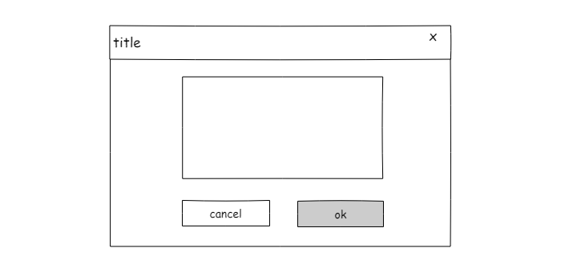
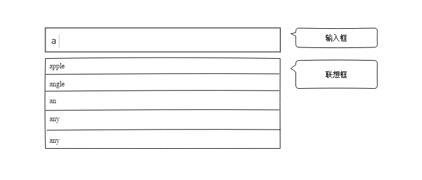

# function -> 组件 -> sdk

> 写在前面：在开发的过中很多时候都会用到组件，有的人在初期搭建了项目，有的后来就可以直接使用项目中已有的组件。但是当需求中有一个需求是项目中没有的组件，这个组件又可能是以后常用的组件，那我们只能自己动手写组件了。


## 组件是什么

我的理解是，项目中反复会用到，具有固定功能的模块。比如：弹框，日历，autocomplete，当然还有所有的表单元素。

为了说的简单，就拿一个相对独立的组件弹窗来举例。如果自己需要实现一个弹窗，我们应该如同动手？

回到我说的定义，组件是具有固定功能的模块，意思就是说只要我适当的使用它，它总能实现固定的功能。

## 组件要素

那我可以抽象的认为，组件就像一个function，一个function通常的要素是什么：名字，入参，返回值。

```js
var myFunction = function (a, b) {return a * b}
```

组件其实和这个很相似，举个例子，弹框组件通常是下面这个的样子。



### 入参

* content

  从图上我们很容易看出，几乎只有中间部分的内容是需要调用者自己输入的内容。其他的我们希望只要初始化这个组件，就有一个一模一样的弹窗出现。

  如果我们把组件当成一个function的话，那我们找到了弹窗组件需要用户输入的第一个内容：中间的内容，我们用一个变量content来表示。


* title

  还有什么事需要输入的呢？没错title，我们其实不希望new一个弹窗以后出现的title是“title”，几个字，而是我们自己定义的名字，这样我们就找了第二个需要输入的变量：title。


* 点击ok按钮的回调函数

  通常使用者点击了弹框上面的ok按钮，代表用户同意做某个事情，那些可以执行接下来的操作，那些操作其实和弹框组件本身无关，但是点击ok按钮又必要要触发这个逻辑，那我们选择以回调函数的方式传进组件来。

* 组件宽度

### 组件本身的功能

本身的功能是指那些不需要依赖外部参数就能完成的功能。

* 关闭

  这个弹窗的右上的关闭按钮和cancel按钮点击以后通常会关闭弹窗，这个功能通常可以在组件本身完成。因为关闭弹窗不需要处理任何问题

* 初始化

  初始化这个组件一定会发生，因为既然是一个组件，想要使用就会初始化。

### 返回值

组件返回其实就是就是一个弹框。


## 组件开发

有了上面的开发，我们大致能想象出如下框架

```javascript
var Modal = Regular.extend({
    name: 'modal',
    template: tpl,
    config: function() {
      _.$extend(this.data, {
          title: 'title', //默认属性值
          width：400,
          content: '',
          okButton: true,
          cancelButton: false,
          visible:true
      });
      this.supr();
    },

    init: function() {
      this.supr();
      this.$inject(document.body);
    },

    ok: function() {
      this.$emit('ok');
      this.destroy();
    },

    cancel: function() {
      this.$emit('cancel');
      this.destroy();
    }
  });
```

可以说所有的入参都是组件的可配置功能，入参有的必须传入的，有的是非必传的。大部分的情况我们会给某些参数写一个默认值，如果开发者在初始化的时候灭有传这个参数，就使用默认值。但也有一些必传参数无法给与默认值，必须由开发者传入。

可以说这就是组件的基本架构，有传入的参数，有组件自己的变量和方法，有回调函数。

## 其他组件开发

同理，我们可以分析出一个autocomplate组件架构



这个组件大家一定不陌生，就是复杂一点的输入框。基本功能是，当用户输入的时，能根据输入的字符匹配到联想内类展示在下面，如果用户点击或者用键盘选择某个值则联想框消失，或者输入的字符没有匹配到联想的任何内容，联想框也不会出现。最后，如果用户点击了联想框以外的地方，联想框也消失。

https://github.com/reactjs/react-autocomplete/blob/master/lib/Autocomplete.js

* 入参：

  * 联想的数据源items（可以是静态的，也可以是请求得到的数据）
  * 当用户选择了某个值最后的结果返回给回调函数getVal

* 功能：

  * 获取input输入的值getInputValue
  * 监听input的变化onChange
  * 监听键盘选择onSelect
  * input失焦，则收起联想，并返回最终值onInputBlur

* 返回值：

  * 最终用户选择的联想值，如果没有选择的联想值则返回input框输入的值

所以根据上面的分析，我们组件大致是下面这个样子：

```js
var Autocomplate = Regular.extend({
    name: 'autocomplate',
    template: tpl,
    config: function() {
      _.$extend(this.data, {
          items: {}, //默认属性值
          isOpen: false，
          realValue：''
      });
      this.supr();
    },

    init: function() {
      this.supr();
    },

    onChange: function() {
      this.data.isOpen = true;
      this.getRealValue();
      this.$emit('getVal',this.data.realValue);
    },

    onSelect: function() {
      this.data.isOpen = false;
      this.getRealValue();
      this.$emit('getVal',this.data.realValue);
    },

   onInputBlur: function() {
     this.data.isOpen = false;
     this.getRealValue();
     this.$emit('getVal', this.data.realValue);
    },

   getInputValue: function() {
      return this.data.input;
    },

    getRealValue: function() {

    }
  });
```

这里只是写个大概，最终当然还有很多需要处理的内容。但是大体的结构也就是那三个最重要的要素。入参，功能，返回值。也就是，传入的静态变量和回调函数，组件本身的功能函数，和返回值。

事实上我们很多常用的组件，都是用这样的思路写出来的，像slider，page等，但是根据功能的不同复杂程度也不同。


## SDK的开发

SDK是什么？我的理解就是具有一定功能的集合，这听起来是不是和组件很相似。没错，我觉得非常相似。

下面举个栗子：

```js
new SDK({
        container: elementID,
        onSuccess: function (result) {
          if (result.ret) {
  			//一些处理
          }
        },
        onFail: function () {
          //一些处理
        }
      });
```

这个SDK的组件有3个入参，分别是1个静态变量和两个回调函数，从onSuccess回调函数可能看出，这个这组件的返回值是result。这就是最常见的SDK初始化过程。

### SDK功能

需要提供给其他业务方一个SDK，这个SDK的功能是：初始化一个登录的表单到指定的位置(div)，然后在这个表单提交后获取到我方服务器返回信息。

说白了就是，他们new一下就出现一个我们提供的登录框，如下图：


初步分析

* 入参:
  * 需要指定的div的id
  * 需要成功和失败的回调函数
* 功能：
  * 我方负责渲染页面插入指定的id的div
  * 我方服务器返回的信息要通知业务方，涉及到跨域
  * 成功以后执行回调函数
  * 销毁SDK
* 返回值：
  * ret

综上，我们的SDK大概的样子就是这样：

```js
define([], function(){

  var SDK = function(options){
    options = options || {};
    this.container = options.container;
    this.createBody(options);
    this.onMessage(options.onSuccess, options.onFail);
  },

  pro = SDK.prototype;

  pro.createBody = function(options){
    this.body = this.container;
    this.addIframe('https://fdfdfdfd');
  }

  pro.addIframe = function(url){
    this.nIframe = document.createElement('iframe');
    this.nIframe.src = url;
    this.body.appendChild(this.nIframe);
  }

  pro.onMessage = function(onSuccess, onFail){
    window.onmessage = util._$bind(function(event){
      event = event || window.event;
      var data = JSON.parse(event.data),
          ret = data.ret;
      if(ret){
        if(typeof onSuccess=== 'function')){
          onSuccess.call(this, data);
        }
      }else{
        if(typeof onFail=== 'function'){
          onFail.call(this);
        }
      }
    }, this);
  }

  pro.close = function(){
    document.body.removeChild(this.__body);
  }

  window.NEO = NEO;
  return NEO;

})
```

以上就是我想要分享的组件和SDK开发思路。