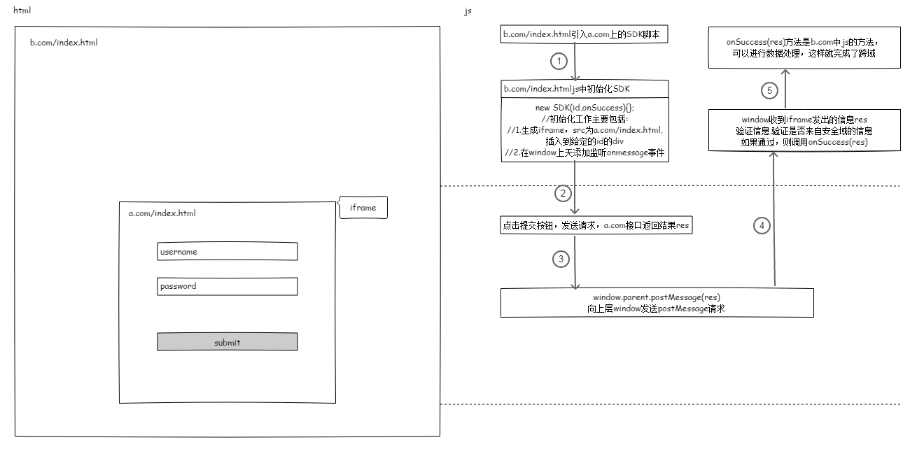

#postMessage 理解和应用

> 写在前面：学习前端的时候，跨域是一定要学习的。关于跨域的方法有很多种，比如document.domain+iframe，window.name + iframe，jsonp...等等。然鹅在学习的时候苦于没有应用场景，往往当时明白了，没多久又忘了。这次是在项目中真实运用到，所以总结下postMesage 跨域的用法。


## 业务场景

需要提供给其他业务方一个SDK，这个SDK的功能是：初始化一个登录的表单到指定的位置(div)，然后在这个表单提交后获取到我方服务器返回信息。

场景分析：第三方在页面中初始化SDK,这个SDK生成一个iframe，iframe中有个表单，提交表单，根据同源策略，提交表单发出的请求是向我方服务器发送的，返回的结果也只能在iframe中，如何把iframe中的消息也就是我方服务器返回的结果传给第三方在页面？这就是跨域，于是postMesage 就派上了用场。

## postMessage定义

postMessage是HTML5 中提供的API,功能是可以安全地实现跨源通信。

## 实现

如果想要从a.com域下index.html发送请求给b.com域下index.html，大致如下实现

### a.com/index.html

```html
<!DOCTYPE html>
<html lang="en">
<head>
  <title>postMessage演示</title>
</head>
<body>
  <iframe id="ifr" src="b.com/index.html"></iframe>
  <script>
  var ifr = document.getElementById('ifr');
  var targetOrigin = "http://b.com";
  ifr.contentWindow.postMessage("hello",targetOrigin);
  </script>
</body>
</html>
```

在a.com/index.html中嵌入一个iframe，获取到这个iframe，用iframe.contentWindow.postMessage发送一个信息

###b.com/index.html

```jsx
<script>
  window.addEventListener("message",function(event){
      if(event.origin == 'http://a.com'){
      alert(event.data);//'hello'
      alert(event.source);
  	}
  },false)
 </script>
```

在b.com/index.html中监听window对象，如果有接收到postMessage，就进行处理。

## 应用

看了上面的例子大概就知道怎么动手了。我的需求几乎和例子一样。大致过程如下图：



## 扩展

1. **window.postMessage() **方法被调用时，会在所有页面脚本执行完毕之后（e.g., 在该方法之后设置的事件、之前设置的timeout 事件,etc.）向目标窗口派发一个  [`MessageEvent`](https://developer.mozilla.org/zh-CN/docs/Web/API/MessageEvent) 消息。 该[`MessageEvent`](https://developer.mozilla.org/zh-CN/docs/Web/API/MessageEvent)消息有几个属性：**

  + MessageEvent.data(只读)

     是来自发送者的数据

  + MessageEvent.origin

    返回一个表示消息发送者来源的

  + MessageEvent.source

    属性记录调用 **window.postMessage() **方法的窗口信息

  **需要注意： **在使用window.postMessage时，第四步当收到消息之后，一定要验证消息的来源，确保是可信任的的网站发来的消息才可以处理，如果实现拟定一个白名单，这个白名单上的域才能进行处理，否则会出现安全问题。

2. **window.postMessage(message, targetOrigin, [transfer]) **方法有3个参数，第一个参数就是需要发送的数据，第二个参数通过窗口的origin属性来指定哪些窗口能接收到消息事件，其值可以是字符串\*（表示无限制）或者一个URI。由于我们是提供给第三方的SDK，所以不确定信息发送给谁，所以用\*，**如果你明确的知道消息应该发送到哪个窗口，那么请始终提供一个有确切值的targetOrigin，而不是\*。不提供确切的目标将导致数据泄露到任何对数据感兴趣的恶意站点。**

## 补充

一个SDK如何能再不同的环境使用呢？因为既然要校验白名单才能对消息进行处理，不能每次不同的环境更改白名单。这时候可是使用一个小技巧