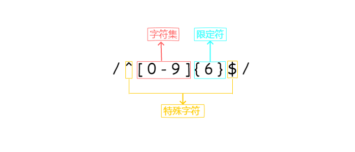

# 理解正则表达式

> 写在前面：正则表达式对于前端开发来说不陌生，虽然使用的频率不是很高，但也难免遇到。可是每次看着网上的解释，我都很头痛。知道项目组中有大神，我决定向大神取经，带我入门。这次的目标就是读懂下面一个表达式：`/^(?:([A-Za-z]+):)?(\/{0,3})([0-9.\-A-Za-z]+)(?::(\d+))?(?:\/([^?#]*))?(?:\?([^#]*))?(?:#(.*))?$/`。这个表达式是从网上找来的。希望通过这次的学习，可以读懂。


## 正则表达式是什么

描述了一种字符串匹配的模式。

这样听起来非常抽象，我的理解是，一系列的规则，可以判断字符串是否符合规则。

常见正则表达式如下：

* `/^(13|14|15|17|18)\d{9}$/`  匹配手机号
* `/^([\w\.-]+)@[\w][\w\.-]*[\w]\.([a-zA-Z]{2,6})$/`  匹配邮箱
* `/^[0-9]{6}$/`  匹配短信验证码

用最简单的一个来举例`/^[0-9]{6}$/`，看下这个是怎么组成的



可以看到，一般的的这则表达式大致由三个部分组成，中括号包起来的字符集，花括号包起来的限定符，以及一些表示特定意思的特殊字符。

**字符集**:表示匹配的字符的集合，上面的例子表示，0,1,2,3,4,5,6,7,8,9

**限定符**：表示对前面的字符集进行某种限定，上面的例子，表示只能是6个字符

**特殊字符**:**^**表示匹配输入字符串的开始位置

**特殊字符**:**$**表示匹配输入字符串的结束位置

所以所有的连接起来的意思是只能是0-9中的6个数字组成的字符串。如094567,547845，这种就是符合规则的，dfd456这种就不符合规格。


## 进阶

看了上面的例子，感觉好像懂了。然而回头看看这篇文章的目标

```js
/^(?:([A-Za-z]+):)?(\/{0,3})([0-9.-A-Za-z]+)(?::(\d+))?(?:\/(?#))?(?:\?(#))?(?:#(.*))?$/
```

是不是感觉一脸懵逼，百脸懵逼，我是谁？我在哪里？······

接下来，为了能解说这个正则表达式，我们再来学习一些符号。

### ()

查阅网站得到如下解说：`标记一个子表达式的开始和结束位置。子表达式可以获取供以后使用`

看了又是一脸懵逼，什么意思？

举个栗子：一个匹配网站二级域名的正则表达式如下：

```js
var regParentHost = /^.+\.(\w+\.\w+)(:.*)?$/

regParentHost.exec('https://xxdfd.163.123.com:8080')

// ["https://xxdfd.163.123.com:8080","123.com",":8080"]

```

经过观察，这个正则表达式与第一个例子表达式有个很重要的区别，就是有（）。看到上面的结果，可以看出exec返回一个数组，数组的第二值就是我们想要的域名。为什么是第二个呢？

有的文章解释说：括号被称为 捕获括号。我们把括号去掉，得到如下表达式:

```js
var regParentHost = /^.+\.\w+\.\w+:.*$/

regParentHost.exec('https://xxdfd.163.123.com:8080')

// ["https://xxdfd.163.123.com:8080"]
```

结果如上，没有返回域名和端口号，而加上了两个小括号，就会得到3个结果。

我们来尝试添加一个（）

```js
var regParentHost = /^.+\.(\w+\.\w+):.*$/

regParentHost.exec('https://xxdfd.163.123.com:8080')

// ["https://xxdfd.163.123.com:8080","123.com"]
```

结果如我所想，返回了两个值。这样我们再看`标记一个子表达式的开始和结束位置。子表达式可以获取供以后使用`

这个解释好像能明白一些。如果出现括号，则认为是一个子表达式，如果字符串中有满足子表达式的，将这些字符串保存起来，最后可以以数组的形式返回。如果括号中的子表达式没有被匹配到，就返回undefined。

也就是说有几个（）就会有几个结果返回。

### ?

说完（），就来说重头戏问号。

#### ?用法1:

#### 匹配前面一个表达式0次或者1次。等价于 {0,1}

查阅网站，解说如下：匹配前面一个表达式0次或者1次。等价于 {0,1}。

还是这个栗子：

```js
var regParentHost = /^.+\.(\w+\.\w+)(:.*)?$/
```

后半段`(:.*)?`括号后面有个问号。

`：`表示匹配‘：’，

`.`号表示匹配除“`\r`”“`\n`”之外的任何单个字符，

`*`表示匹配前面的子表达式零次或多次。

括号里面连起来就是，匹配：后面的所有字符零次或多次。

然后`？`表示匹配前面一个表达式0次或者1次，换一种说法就是，匹配前面一个表达式有或者没有。

有问号没问号什么区别？看例子：

```js
var regParentHost2 = /^.+\.(\w+\.\w+)(:.*)$/

regParentHost2.exec('https://xxdfd.163.123.com:8080')

// ["https://xxdfd.163.123.com:8080"，"123.com"，":8080"]
-------------------------------------------------------------

var regParentHost = /^.+\.(\w+\.\w+)(:.*)？$/

regParentHost.exec('https://xxdfd.163.123.com:8080')

// ["https://xxdfd.163.123.com:8080"，"123.com"，":8080"]
-------------------------------------------------------------

var regParentHost2 = /^.+\.(\w+\.\w+)(:.*)$/

regParentHost2.exec('https://xxdfd.163.123.com')

// null
------------------------------------------------------------

var regParentHost = /^.+\.(\w+\.\w+)(:.*)？$/

regParentHost.exec('https://xxdfd.163.123.com')

// ["https://xxdfd.163.123.com"，"123.com"，undefined]

```

从上面的例子可以看出来，在测试'htttps://xxdfd.163.123.com:8080' 这个字符串的时候，两者返回的没有区别，但是测试'htttps://xxdfd.163.123.com' 这字符串的时候返回的不一样，一个是在返回的数组中的第三个位置返回undefined，一个直接是null。因为正则表达式中如果有`？` 就表示，有也可以，没有也可以。所以上面的例子中字符串中有没有`：` 都可以匹配成功。如果没有`？` 则表示字符串中一定要有`：` 否则就匹配失败。

上面栗子的正则表达式的目的是提取一个网站的主域名。明眼人一看就知道，这个正则不能达到目的，因为，很多的网站的端口号是默认的，并没有显示出来，像这样'htttps://xxdfd.163.123.com/abc' ，测试结果如下

```js
var regParentHost = /^.+\.(\w+\.\w+)(:.*)?$/

regParentHost.exec('https://xxdfd.163.123.com/abc')

//null
```

果然无法匹配。怎么修改？其实我们已经大致有方向了。

既然是通常的网站，我们可以匹配`：` 后面是数字，数字后面是`/` ,斜杠后面是任意字符

大致的样子就是下面这样

```js
var regParentHostNew = /^.+\.(\w+\.\w+)(:\d+)?(\/.+)?$/

regParentHostNew.exec('https://xxdfd.163.123.com/abc')

// ["https://xxdfd.163.123.com/abc", "123.com", undefined, "/abc"]
-------------------------------------------------------------------------


regParentHostNew.exec('https://xxdfd.163.123.com:8080/abc')

// ["https://xxdfd.163.123.com:8080/abc", "123.com", ":8080", "/abc"]
```

修改的就是加上了匹配冒号后的一个或者多个数字，匹配/后面的任意字符。


上面的例子还没有说完，为什么`(\w+\.\w+)` 中就可以匹配二级域名？

我们引入另一个有关问号的关键概念：**非贪婪** 和**贪婪模式**。


#### ?用法2:

#### 如果**紧跟在任何量词 \*、 +、? 或 {} 的后面**，将会使量词变为**非贪婪**的（匹配尽量少的字符），和缺省使用的**贪婪模式**（匹配尽可能多的字符）正好相反。

再看例子`/^.+\.(\w+\.\w+)(:.*)$/` 中前面的部分`.+\.` ，

`.` 表示匹配除`\r`，`\n`之外的任何单个字符，

`+ ` 可以理解为量词，表示匹配前面一个表达式1次或者多次，

`\.` 匹配点号。

连起来的意思是，匹配任意字符直到点号，那么'htttps://xxdfd.163.123.com/abc' 中，匹配的应该是'https://xxdfdf.'。

再看后面`(\w+\.\w+)` ，

`\w`匹配一个单字字符（字母、数字或者下划线）,

`+` 量词，表示匹配前面一个表达式1次或者多次,

`\.` 匹配点号，

`\w+` 匹配一个单字字符（字母、数字或者下划线)1次或者多次，

`(\w+\.\w+)` 连起来就是匹配xxxx.xxxxx这样的字符串。

根据上面的分析，`(\w+\.\w+)` 匹配到的应该是`163.123` 才对，可是结果却是`123.com` 

这是为何？原来忽略了**非贪婪** 和**贪婪模式** 。

`.+\.` 其中有个量词`+` ,这个加号后面没有跟随一个`?` 则说明处于**贪婪模式** 。这个模式下可以匹配尽可能多的字符。怎么理解呢？

`.+\.` 意思是匹配任意字符直到`.` ,在非贪婪模式下可以匹配到'htttps://xxdfd.163.123.' ，因为点号前面的都可以看成是任意字符，但是，紧接着后面的`(\w+\.\w+)`,需要匹配xxxx.xxxxx，且（）的优先级比较高，所以，优先匹配了'123.com'，最终，`.+\.` 就匹配了'htttps://xxdfd.163' 。

为了证实这个说法，我们可以使用非贪婪模式验证一下

```js
'https://xxdfd.163.123.com:8080/dfdf'.match(/^.+?\.(\w+\.\w+).+$/)

// ["https://xxdfd.163.123.com:8080/dfdf", "163.123"]
```

可以看到，结果就变成"163.123"。


### （？：pattern）

前面的正则表达式中返回的端口号前面有个冒号。

```js
var regParentHost = /^.+\.(\w+\.\w+)(:.*)$/

regParentHost.exec('https://xxdfd.163.123.com:8080')

// ["https://xxdfd.163.123.com:8080"，"123.com"，":8080"]

```

数组第三个元素值是’：8080‘，如果我们不想要其中的’：‘怎么做呢？

下面隆重推出`？` 和其他搭配使用的第一种，和冒号搭配。

查阅网站，得到如下解说`（？：pattern）` ：匹配pattern但不获取匹配的子字符串，也就是说这是一个非获取匹配，不存储匹配的子字符串用于向后引用。

举个栗子：

```js
/^(aaa)(?:b)(ccc)$/.exec('aaabccc')

// ["aaabccc", "aaa", "ccc"]
```

```js
/^(aaa)(b)(ccc)$/.exec('aaabccc')

 // ["aaabccc", "aaa", "b", "ccc"]
```

上面两个唯一不同的地方就是b是被（？：pattern）这样的表达式包围的，再看看之前的解说，匹配pattern但不获取匹配的子字符串，这里就是匹配字母b，但是不会作为结果返回。

所以`/^.+\.(\w+\.\w+)(:.*)$/` 这个正则表达式如果想要匹配到冒号，但是不输出，可以使用（？：pattern）的语法。

```js
/^.+\.(\w+\.\w+)(?::(.*))$/.exec('https://xxxxxxx.163.126.com:8080')

// ["https://xxxxxxx.163.126.com:8080", "126.com", "8080"]
```

知道以上的几个知识点，已经可以解答这个文章最终的正则表达式了。但是为了我以后能更好的理解正则表达式，大神还给我补充了以下知识点


### x(?=y)

匹配'x'仅仅当'x'后面跟着'y'.这种叫做正向肯定查找。

如：

```js
/Jack(?=Sprat)/.exec('JackSprat')

// ["Jack"]
---------------------------------------

/Jack(?=Sprat)/.exec('JackSpraa')
// null
```

/Jack(?=Sprat)/会匹配到'Jack'仅仅当它后面跟着'Sprat'。/Jack(?=Sprat|Frost)/匹配‘Jack’仅仅当它后面跟着'Sprat'或者是‘Frost’。但是‘Sprat’和‘Frost’都不是匹配结果的一部分。

还有一个例子：

```js
/aaa(?=bb)bbc/.exec('aaabbc')

// ["aaabbc"]
-----------------------------------

/aaa(?=bb)c/.exec('aaabbc')
// null
```

这个例子可以看出，匹配aaa，后面必须是bb，但是(?=bb)后面的表达式却是从aaa后面开始匹配，并不是从bb后开始。使用的时候应该注意。


### x(?!y)

匹配'x'仅仅当'x'后面不跟着'y',这个叫做正向否定查找。也就是非的意思。

```js
/aaa(?!bb)/.exec('aaab')

// ["aaa"]
---------------------------------
/aaa(?!bb)/.exec('aaabb')

// null
```

同样

```js
/aaa(?!bb)c/.exec('aaac')

// ["aaac"]
---------------------------------
/aaa(?!bb)c/.exec('aaam')

// null
```

匹配aaa，后面不能是bb，但是(?！bb)后面的表达式却是从aaa后面开始匹配。使用时候应该注意。


## 解惑

最后我们来解读下文章开头的正则表达式

`/^(?:([A-Za-z]+):)?(\/{0,3})([0-9.\-A-Za-z]+)(?::(\d+))?(?:\/([^?#]*))?(?:\?([^#]*))?(?:#(.*))?$/`

我们先按照小括号一部分一部分的拆开：

1. `(?:  ([A-Za-z]+):)?`

   `[a-zA-Z]` 英文字母，

   `+` 量词，匹配前面表达式1次或者多次，

   `：` 匹配冒号

   连起来就是，匹配'abc:'

2. `(\/{0,3})`

   `\/` 匹配'/'

   `{0,3}` 量词，匹配前面表达式0到3次，

   连起来就是，匹配'///'

3. `([0-9.\-A-Za-z]+) ` 

   `0-9` 匹配数字

   `.` 中括号里面的点表示点号本身‘.’

   `\-` 匹配短横线‘-’

   `A-Za-z` 字母

   `+` 匹配一次或多次，后面没有‘？’，所以使用贪婪模式，尽量匹配多的字符串。

   连起来就是，匹配字母或者数字'.'或者‘-’，匹配‘abc0123.dfdfdf’

4. `(?:  :(\d+))?` 

   `:` 匹配冒号

   `(\d+)` 匹配数字，尽可能多的匹配

   `(?:  :）` 匹配冒号，但是冒号不作为结果返回

   连起来就是，匹配‘:8080’这样的字符串，然后返回的只有‘8080’。

5. `(?:  \/([^?#]*))?`

   ` \/` 匹配‘/’

   `[^?#]` 匹配所有字符除了‘？’或者‘#’

   `*` 量词，匹配前一个表达式0次或多次

   `(?:  \/)` 匹配‘/’,但不作为结果输出

   连起来就是，匹配斜杠后面的任意字符直到遇到'？'或者'#'，也就是'/aaaa',返回'aaaa'。

6. `(?:   \?([^#]*))?`

   `\?` 匹配问号’？‘

   `[^#]` 匹配所有字符除了‘#’

   `*` 量词，匹配前一个表达式0次或多次

   `(?:  \?)` 匹配‘？’,但不作为结果输出

   连起来就是，匹配问号后面的任意字符直到遇到‘#’，也就是'?c=4',返回’c=4‘。

7. `(?:  #(.*))?`

   `#` 匹配’#‘

   `.` 匹配除换行符 \n 之外的任何单字符

   `*` 量词，匹配前面的子表达式零次或多次，默认匹配多次

   `(?:   #)  ` 匹配’#‘号但是不作为返回值

   连起来就是，匹配#号后面任意字符，也就是，’#bbb‘，返回’bbb‘

综上，整个表达式就是匹配**'htttps://domain.com:1000/ac/asdasdf?query=xx#dasf'** 这样的字符串，并且返回字符串的各个部分。


```js
/^(?:([A-Za-z]+):)?(\/{0,3})([0-9.\-A-Za-z]+)(?::(\d+))?(?:\/([^?#]*))?(?:\?([^#]*))?(?:#(.*))?$/
.exec('https://domain.com:1000/ac/asdasdf?query=xx#dasf')

// ["https://domain.com:1000/ac/asdasdf?query=xx#dasf"

// , "https", "//", "domain.com", "1000", "ac/asdasdf", "query=xx", "dasf"]
https://domain.com:1000/ac/asdasdf?query=xx#dasf
```

看到这里，我想已经能看懂大部分的正则表达式了。还有什么看不懂的可以自己查阅资料来学习。

